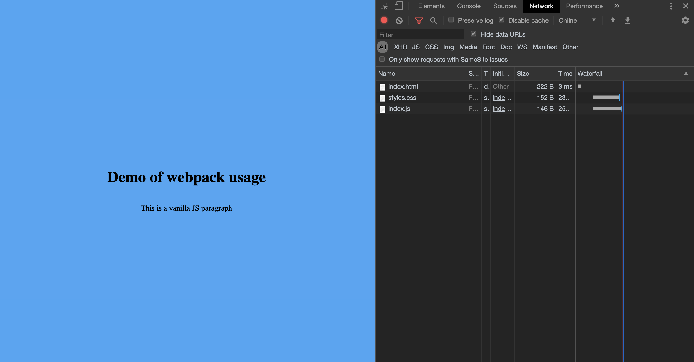

# Getting Started

## Setup

- Make sure you have `yarn` installed on your machine

```shell
brew install yarn
```

- clone the `webpack-demo` repository

```shell
git clone git@github.intuit.com:lshadler/webpack-demo.git
```

- install dependencies for the project

```shell
cd webpack-demo
yarn
```

- Open up `index.html` in a browser of your choice. Make sure it displays appropriately

```shell
open /Path/to/repo/webpack-demo/index.html
```



## Next Steps

Next, head to [step one](step-1-creating-the-bundle.md) to create your first bundle!
