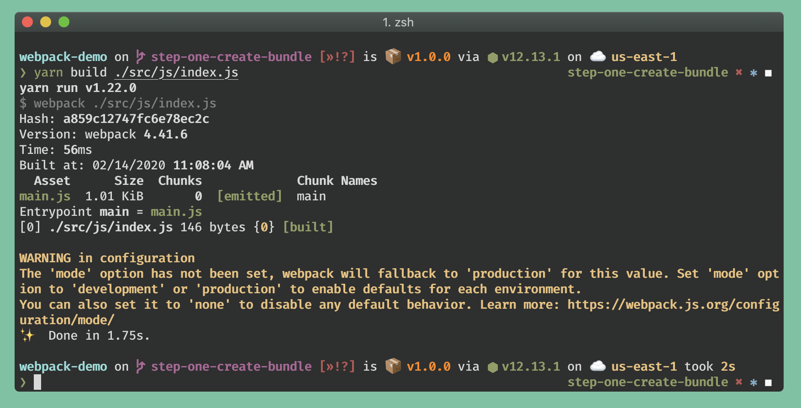
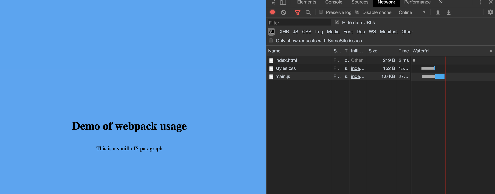

# Creating our first webpack bundle

## Process

- add build script to `package.json`

```diff
   "devDependencies": {
     "webpack": "^4.41.6",
     "webpack-cli": "^3.3.11"
+  },
+  "scripts": {
+    "build": "webpack"
   }
 }
```

- modify the `index.html` to point to `./dist/main.js`

> NOTE: main.js is the default bundle name for webpack
> NOTE: dist is the default output folder for webpack

```diff
 <body>
     <h1>Demo of webpack usage</h1>
-    <script src="./src/js/index.js"></script>
+    <script src="./dist/main.js"></script>
 </body>

 </html>
```

- run the build script, specifying the "entry" for your bundle (in this case `./src/js/index.js)

> Webpack will take an "entry" file and collect all files/modules needed by that entry file. Anything not explicitly needed by this entry file will be excluded. The default entry file is src/index.js

```shell
yarn build ./src/js/index.js
```




- verify that the page still loads. Note the network traffic retrieving `main.js`



## Next Steps

Head over to [step two](./step-2-adding-modules.md) to add node modules to your bundle!
