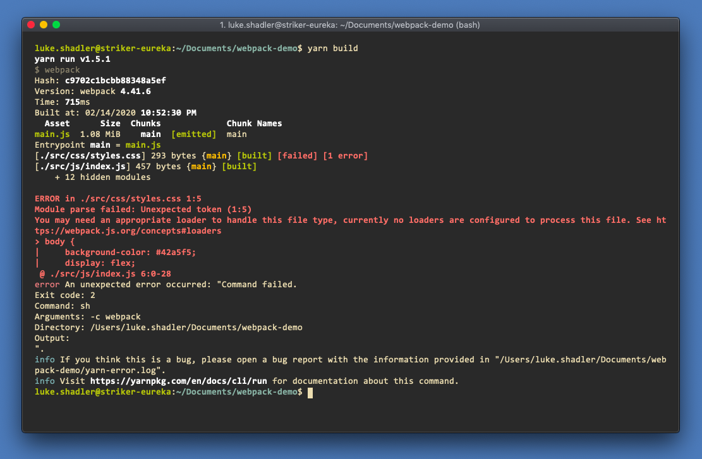
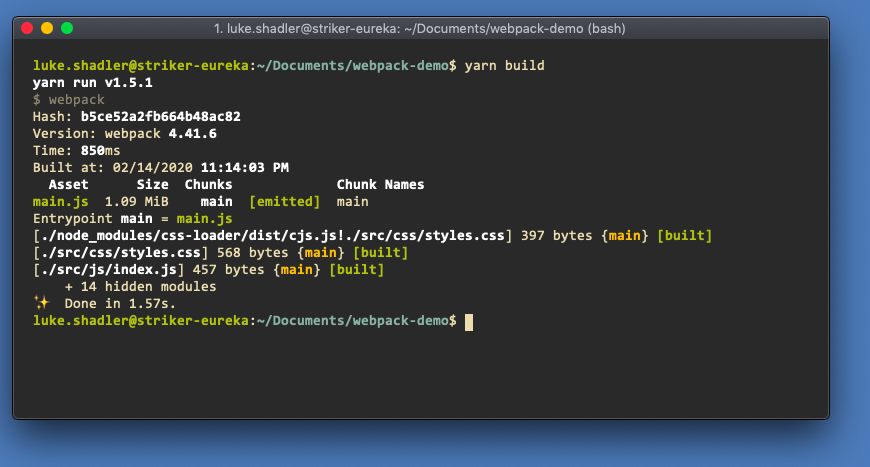
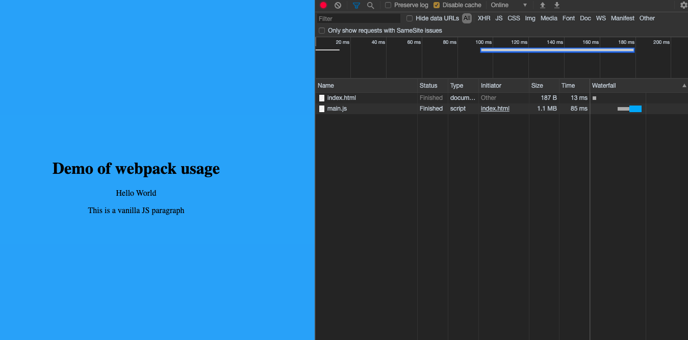

# Using Webpack Loaders

## Problem

When we are bundling our app, we sometimes want to add non-JS files into the bundle, such as

- HTML
- CSS
- YAML
- Markdown

Webpack with it's base 

## Solution: Loaders!

A loader is a node module that basically transpiles a given file type into something that can be interpreted by the Webpack runtime. These files will be effectively converted into the Javascript snipped that will provide the same data. We can modify our Webpack config to use loaders while generating our bundle.

## Process

- Modify the bundle to require the CSS file directly

```diff
 var React = require("react");
 var ReactDOM = require("react-dom");

+// Import our CSS
+require("../css/styles.css");
+
 // Create Div with content
 var el = document.createElement('p');
```

```diff
 <head>
     <title>IUX Webpack Demo</title>
-    <link rel="stylesheet" href="./src/css/styles.css" />
 </head>
```

-  run the build command and check the output

```shell
yarn build
```



> The build failed because Webpack has no way of understand

- Let's install some loaders! 

```shell
yarn add --dev style-loader css-loader
```

- Add the loader to the webpack configuration

```diff
   output: {
     filename: "main.js",
     path: path.resolve(__dirname, "dist")
+  },
+  /**
+   * Defines how modules are interpreted (including loaders)
+   */
+  module: {
+    rules: [
+      {
+        // Regex match on the file to load differently
+        test: /\.css$/,
+        // What loaders (works bottom-to-top) will be applied
+        // In this case,
+        //    source -> css-loader -> style-loader -> bundle
+        use: [
+          "style-loader",
+          "css-loader"
+        ]
+      }
+    ]
   }
 };
```

- Run the build command and watch the magic!

> The loaders have interpreted the css files and bundled it into the Javascript output



- Observe the `index.html` page. Note that there is now only one file requested for both of them



## Next Steps

Check out some of the advanced use cases in the next sections!
